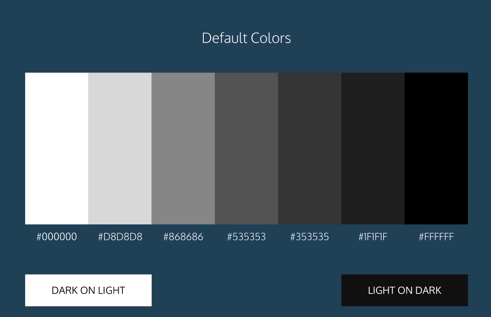

# CSS Basics

### More than one selector:

- **Chaining selectors** have two classes for the same element and look like this: 

    `h1.special` (with dot between them)

- **Nested selectors** are classes within other classes and are written with a space between the selectors like this: 

   `h1 special`


- **Multiple selectors** are two selectors that receive the same styling. They are separated by a comma like this: 

    `h1, .special`

### Cascade Order of link pseudo-classes:
*mnemonic: LoVe HAte*
 - `:link`
 - `:visited`
 - `:hover`
 - `:focus`
 - ` :active`   

 ### Margin Auto
 In order for `margin: 0 auto;` to work a width must be set for the element.
 Example:
 ```div.headline {
  width: 400px;
  margin: 0 auto;
}
```
### Margin Collapse

Unlike horizontal margins, vertical margins do not add. Instead, the larger of the two vertical margins sets the distance between adjacent elements.

### Outline all the boxes in the DOM
Enter this at the top of the stylesheet to outline all boxes in the DOM (‘x-ray’ view) :

`* {`
     `border: 1px solid red !important;`
`}`

### Positioning of elements in CSS:
- `position:static;` normal flow, default setting, z-index will not work on static element, float will work on a static element
- `position:relative;` places an element relative to normal document flow, float will work on a relative element
- `position:absolute;` places an element relative to its containing element, moves with the rest of the content when the user scrolls
- `position:fixed;` places an element relative to the browser window, does not move when user scrolls 

- The fix for the parent element containing only floated elements collapse: Add these two CSS rules to the parent element:
```
overflow: auto;
width: 100%;
```
### Display of elements using CSS:
- `display:inline;` box wraps around content only, cannot be altered in size with CSS height and width properties

- `display:block;` default width is the entire width of the page, default height is tall enough to accommodate the content, height and width can be specified in CSS

- `display:inline-block;` can be displayed next to each other on the page, height and width can be specified in CSS, images are an example of inline-block elements

### Difference between `em` and `rem`

- `em` is a size relative to the font-size of a parent element, the default font size of the browser will be used if no other parent size is specified
- `rem` is the size relative to the root element, which is found in the `<html>` tag

### Relative sizing of non-text HTML elements
- In responsive websites, non-text HTML elements are sized relative to their parent elements using percentages.

- Use `min-width` and `max-width` to ensure legible content by limiting min and max widths. Use pixels as units to ensure hard limits on these sizes

- Scaling images and videos in a responsive site,  use the code below to scale the image to the full width of its container, as well as scale the height proportionally to the width. Setting to block level instead of the default `inline-block` image state will prevent text from aligning alongside the image.

```
.container img {
  max-width: 100%;
  height: auto;
  display: block;
}
```
---
### Flexbox Basics
- `display: flex` changes an element to a block-level container with flex items inside of it.
- `display: inline-flex` allows multiple flex containers to appear inline with each other.
- `justify-content` is used to space items along the major axis.
- `align-items` is used to space items along the cross axis.
- `flex-grow` is used to specify how much space (and in what proportions) flex items absorb along the major axis.
- `flex-shrink` is used to specify how much flex items shrink and in what proportions along the major axis.
- `flex-basis` is used to specify the initial size of an element styled with `flex-grow` and/or `flex-shrink`.
- `flex` is used to specify `flex-grow`, `flex-shrink`, and `flex-basis` in one declaration
- `flex-wrap` specifies that elements should shift along the cross axis if the flex container is not large enough.
- `align-content` is used to space rows along the cross axis.
- `flex-direction` is used to specify the major and cross axes.
- `flex-flow` is used to specify `flex-wrap` and `flex-direction` in one declaration.
- Flex containers can be nested inside of each other by declaring `display: flex` or display: `inline-flex` for children of flex containers.
---
### CSS Grid Basics
- `grid-template-columns` defines the number and sizes of the columns of the grid
- `grid-template-rows` defines the number and sizes of the rows of the grid
- `grid-template` is a shorthand for defining both `grid-template-columns` and `grid-template-rows` in one line
- `grid-gap` puts blank space between rows and/or columns of the grid
- `grid-row-start` and `grid-row-end` makes elements span certain rows of the grid
- `grid-column-start` and `grid-column-end` makes elements span certain columns of the grid
- `grid-area` is a shorthand for `grid-row-start`, `grid-column-start`, `grid-row-end`, and `grid-column-end`, all in one line
---
### Default UI Colors


---
