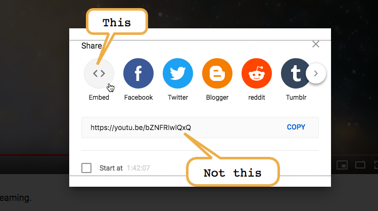

# HTML Notes

Embedding YouTube videos: Select the Embed button (first selection) NOT the link, when embedding a YouTube video into HTML. The Embed button contains an iframe with the link and the correct height and width preloaded.

### Text Design Best Practices
- Ideal line length for text on websites is about 50-75 characters per line. Use columns, instead of longer lines of text, to control line length. 

- Use 2-3 well paired fonts, but no more. 

- Adjust font style, size, weight, spacing, and color.

- Whitespace plays a big part in readability. Make sure all of your text elements have enough whitespace. 

- Use standard convention for links and navigation buttons so users know what to expect. 

- Use columns when necessary to keep line length at around 50-75 characters. 

- Use colored cards to pair images with important text so users eyes are drawn towards it. 

- Have the elements you want users to notice at the top of the page, or down the left hand side, because those are the areas of the page users will notice when skimming. 