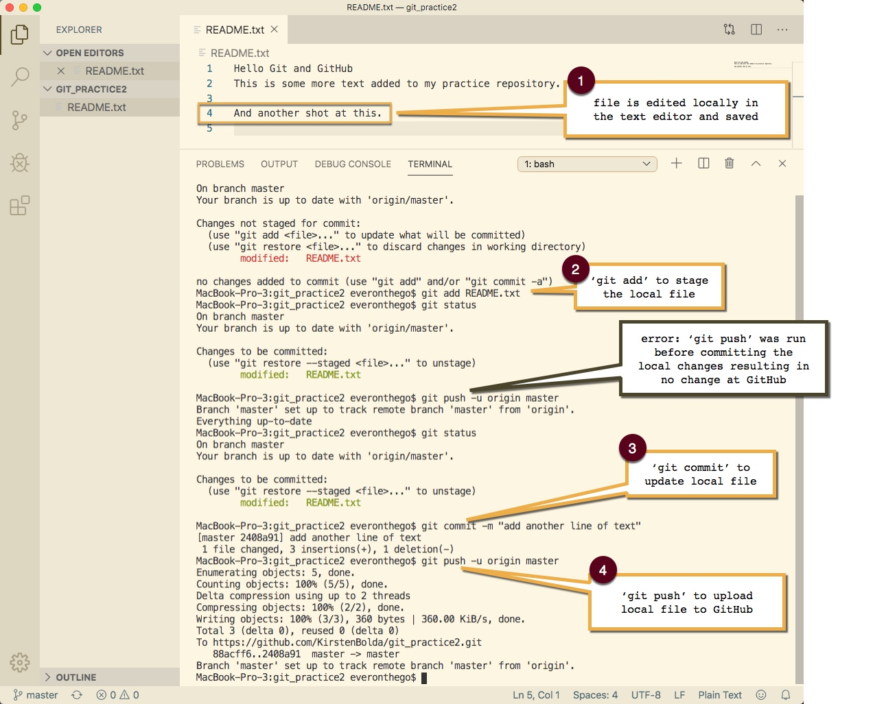

# Internet Basics

### The difference between the internet and the world wide web:

- the internet refers to the actual network of connected computing devices
- the world wide web is a collection of interlinked websites and web resources
(internet=network, worldwide web=sum of networks, the application)
- other internet applications besides the world wide web are email and BitTorrent
- Mobile applications are not part of the world wide web, as the web consists of links, and a mobile app is designed to keep the user’s attention on the app itself.

### Cloud computing
- Cloud computing allows consumers and businesses to treat computing as a utility, leaving the technical details to technology companies. (Example: Google Docs)

### Basic Structure of Webpages
- separate languages for content (html) and presentation (css) are an example of ‘separation of concerns’, a computer science principle (corresponding to ‘coupling’ and ‘cohesion’)

- Excellent video about HTML structure, hierarchy and using HTML semantic tags to avoid ‘divitis’ [HTML Structure](https://www.youtube.com/watch?v=uxmB8MlO3m8)

### GitHub

-Pushing local files to the remote GitHub repository:remote-repo.jpg

### Building a Portfolio Website

- David Castaneda's Portfolio site:
[David Alfonso Castandeda](https://hireanalf.com/)

- Codecademy article about building a web developer portfolio: (contains lots of links to other resources including website templates to modify and use as samples of my own work.)
[Guide: How to Build a Web Dev Portfolio](https://discuss.codecademy.com/t/guide-how-to-build-a-web-dev-portfolio/394816)
